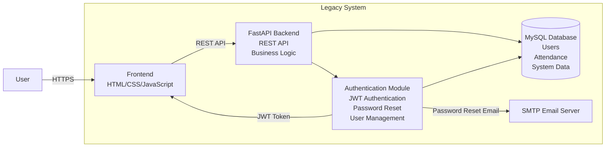

# C4 Level 2 Container Diagram (Mermaid.js)

---

# Three Specific Code Smells

## 1. God Object

**Location:** `auth.py`

**Description:**

The `auth.py` module performs multiple unrelated responsibilities, including:

- User authentication
- JWT token generation
- JWT verification
- Password hashing
- Password reset
- Email sending
- Database queries
- Login validation

This violates the **Single Responsibility Principle (SRP)** because one module is responsible for many different concerns. It makes the code difficult to maintain, test, and extend.

---

## 2. Hardcoded Coupling

**Location:** `auth.py`

**Description:**

The authentication module is tightly coupled to several implementation details, including:

- JWT algorithm (`HS256`)
- OAuth login endpoint
- SMTP email service
- SQLAlchemy database models
- Default frontend URL

These hardcoded dependencies reduce flexibility and make it difficult to replace or mock components during testing.

---

## 3. Low Cohesion (Feature Envy)

**Location:** `auth.py`

**Description:**

Functions such as:

- `login_user()`
- `register_user()`
- `forgot_password()`

perform many unrelated tasks within a single function, including:

- Reading and writing to the database
- Generating JWT tokens
- Sending emails
- Validating user input
- Returning HTTP responses

Instead of delegating these responsibilities to dedicated services (e.g., `UserService`, `TokenService`, or `EmailService`), the functions contain too much business logic, making them harder to understand, test, and maintain.
## Cryptographic Handshake Mechanism (JWT Authentication)

To transition from the monolithic dependency model to an isolated, secure microservice infrastructure, the architecture utilizes a **JSON Web Token (JWT) Cryptographic Handshake**. This avoids chatty database verification loops across services.

### The Handshake Sequence

1. **Token Issuance (Authentication Request):**
   When a service component or external interface attempts to locate and utilize a service discovered by the `ServiceFactory`, it passes credentials to the `JWTAuthService`.
   
2. **Signature Computation:**
   The auth service generates an independent JSON object holding explicit metadata assertions (`sub`, `scope`, `iat`, `exp`). This payload is concatenated with a base64encoded header specifying the algorithm (`HS256`). A cryptographic Hash-based Message Authentication Code (HMAC) is then computed utilizing the private `JWT_SECRET_KEY`:
   $$\text{Signature} = \text{HMAC-SHA256}(\text{base64(Header)} + \text{"."} + \text{base64(Payload)}, \text{SECRET\_KEY})$$

3. **Transmission & Structural Integrity:**
   The resulting compact string (`header.payload.signature`) is dispatched back to the caller. The receiving microservice can completely trust the data structure without consulting a central database because any modification to the client payload or expiration date string will instantly invalidate the final signature block.

4. **Verification Gate:**
   Upon calling target microservices, the token is decoded and validated locally within `auth.py`. If the system detects a single bit variance or an outdated timestamp boundary, an access rejection exception triggers natively.