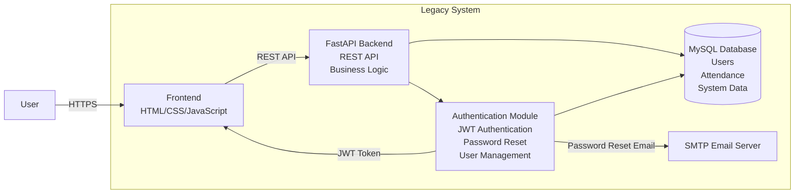

# C4 Level 2 Container Diagram (Mermaid.js)

---

# Three Specific Code Smells

## 1. God Object

**Location:** `auth.py`

**Description:**

The `auth.py` module performs multiple unrelated responsibilities, including:

- User authentication
- JWT token generation
- JWT verification
- Password hashing
- Password reset
- Email sending
- Database queries
- Login validation

This violates the **Single Responsibility Principle (SRP)** because one module is responsible for many different concerns. It makes the code difficult to maintain, test, and extend.

---

## 2. Hardcoded Coupling

**Location:** `auth.py`

**Description:**

The authentication module is tightly coupled to several implementation details, including:

- JWT algorithm (`HS256`)
- OAuth login endpoint
- SMTP email service
- SQLAlchemy database models
- Default frontend URL

These hardcoded dependencies reduce flexibility and make it difficult to replace or mock components during testing.

---

## 3. Low Cohesion (Feature Envy)

**Location:** `auth.py`

**Description:**

Functions such as:

- `login_user()`
- `register_user()`
- `forgot_password()`

perform many unrelated tasks within a single function, including:

- Reading and writing to the database
- Generating JWT tokens
- Sending emails
- Validating user input
- Returning HTTP responses

Instead of delegating these responsibilities to dedicated services (e.g., `UserService`, `TokenService`, or `EmailService`), the functions contain too much business logic, making them harder to understand, test, and maintain.